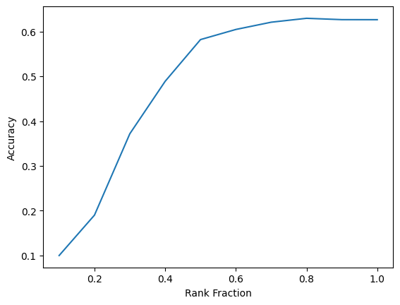
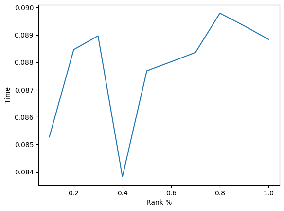
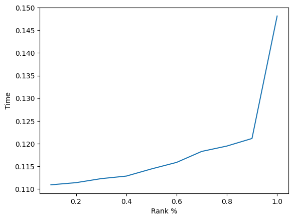

# Reducing Neural Model Complexity: A Comparative Study
We use Pruning and Low-Rank Approximation for Model Compression. LRA computed using Singular Value Decomposition.

## Accuracy comes down with Low-Rank Approximation

As the rank fraction decreases, the accuracy of the estimation also decreases. This tradeoff is expected, as lower-rank approximations 
degrade the information of the original estimated matrix.

## Effect on Latency under Low-Rank Approximation

The results, shown in the graph, suggest that there is no clear trend. Although lower-rank approximations can reduce the rank of the 
weight matrix, the number of operations required for matrix multiplication remains the same.

## Inference in Factorized Space
For this experiment, the weight matrix of the neural network has been replaced with its factorized version. By using low-rank approximation
techniques, the weight matrix can be decomposed into smaller factor matrices, which can lead to improved efficiency and reduced 
storage requirements.

As the rank percentage of the matrix decreases, the inference time decreases due to the reduced number of operations required for computation.

Explaination:

The computation time in the factored space takes O(k(n+d)) time, where k is the number of singular values used for low-rank 
factorization, and n by d is the size of the actual matrix.This is compared to the O(nd) time required for computation in the actual space. 
Therefore, reducing the rank of the weight matrix through low-rank approximations can lead to faster inference times, especially when the 
matrix is large.
